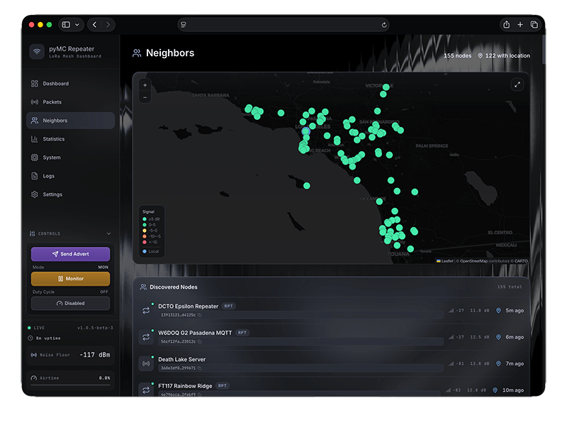
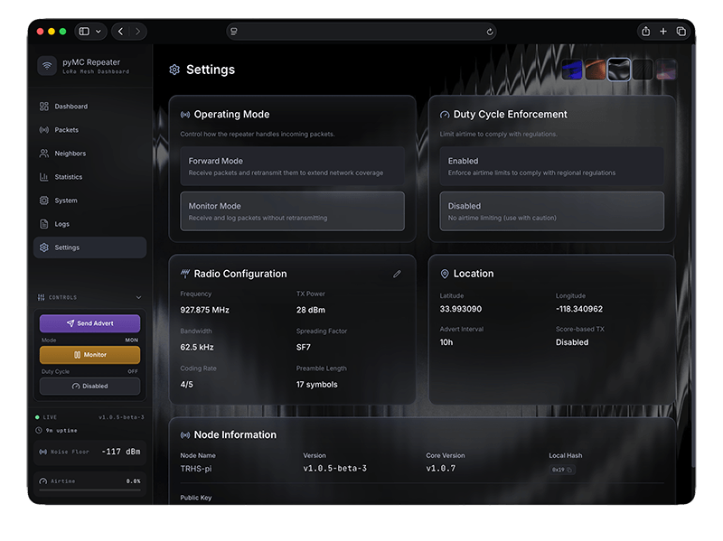
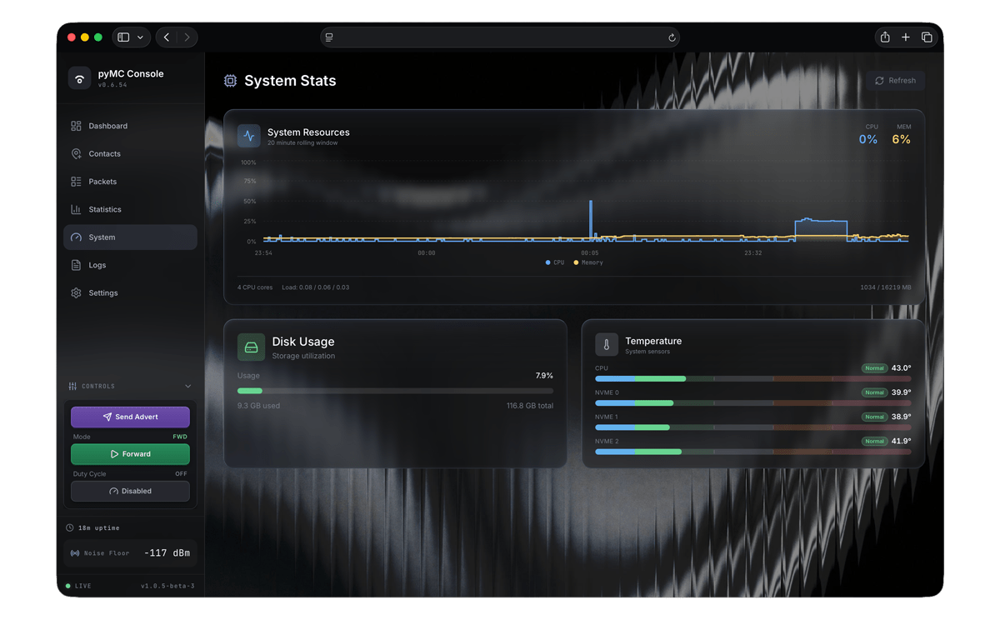

# pyMC Console

[](https://github.com/dmduran12/pymc_console/releases)
[](LICENSE)

A modern web dashboard for monitoring and managing your [MeshCore](https://meshcore.co.uk/) LoRa mesh repeater.

Built on [pyMC_Repeater](https://github.com/rightup/pyMC_Repeater) by [RightUp](https://github.com/rightup), pyMC Console provides real-time visibility into your mesh network with an intuitive interface.

## Features

### Dashboard
- **Live packet metrics** — Received, forwarded, dropped packets with sparkline charts
- **TX Delay Calculator** — Recommends optimal delay settings based on duplicate rate
- **Time range selector** — View stats from 20 minutes to 7 days
- **Recent packets** — Live feed of incoming traffic


### Statistics
- **Traffic flow chart** — Stacked area showing RX/forwarded/dropped over time
- **Link quality polar** — Neighbor signal strength by compass bearing
- **Packet types treemap** — Distribution of ADVERT, TXT_MSG, ACK, etc.
- **Noise floor heatmap** — RF interference patterns over time


### Neighbors
- **Interactive map** — OpenStreetMap view with neighbor positions
- **Neighbor list** — RSSI, SNR, last seen, direct vs relayed
- **Mesh topology graph** — Visualizes network connections inferred from packet paths
- **Intelligent disambiguation** — Resolves ambiguous node prefixes using geographic + co-occurrence analysis



### Packets
- **Searchable history** — Filter by type, route, time range
- **Packet details** — Hash, path, payload, signal info, duplicates

### Settings
- **Mode toggle** — Forward (repeating) or Monitor (RX only)
- **Duty cycle** — Enable/disable enforcement
- **Radio config** — Live frequency, power, SF, bandwidth changes



### System & Logs
- **Hardware stats** — CPU, memory, disk, temperature
- **Live logs** — Stream from repeater daemon



## Quick Start

### Requirements

- Raspberry Pi (3, 4, 5, or Zero 2 W)
- LoRa module (SX1262 or SX1276 based)
- Raspbian/Raspberry Pi OS (Bookworm recommended)

### Installation

```bash
# Clone this repository
git clone https://github.com/dmduran12/pymc_console.git
cd pymc_console

# Run the installer (requires sudo)
sudo bash manage.sh install
```

The installer will:
1. Install all dependencies
2. Set up [pyMC_Repeater](https://github.com/rightup/pyMC_Repeater)
3. Deploy the web dashboard
4. Configure the systemd service

Once complete, access your dashboard at `http://<your-pi-ip>:8000`

## Management Menu

After installation, run `sudo bash manage.sh` to access the management menu:

```
┌─────────────────────────────────────┐
│     pyMC Console Management         │
├─────────────────────────────────────┤
│  1. Start Service                   │
│  2. Stop Service                    │
│  3. Restart Service                 │
│  4. View Logs                       │
│  5. Configure Radio                 │
│  6. Configure GPIO                  │
│  7. Upgrade                         │
│  8. Uninstall                       │
│  9. Exit                            │
└─────────────────────────────────────┘
```

### Menu Options

- **Start/Stop/Restart** — Control the repeater service
- **View Logs** — Live log output from the repeater
- **Configure Radio** — Set frequency, power, bandwidth, SF via preset selection
- **Configure GPIO** — Set up SPI bus and GPIO pins for your LoRa module
- **Upgrade** — Pull latest updates and reinstall
- **Uninstall** — Remove the installation completely

## Upgrading

To update to the latest version:

```bash
cd pymc_console
git pull
sudo bash manage.sh upgrade
```

Or use the TUI menu: `sudo bash manage.sh` → **Upgrade**

## Configuration

### Radio Settings

Use the **Configure Radio** menu option, or edit directly:

```bash
sudo nano /etc/pymc_repeater/config.yaml
```

Key settings:
```yaml
radio:
  frequency: 927875000      # Frequency in Hz
  spreading_factor: 7       # SF7-SF12
  bandwidth: 62500          # Bandwidth in Hz  
  tx_power: 28              # TX power in dBm
  coding_rate: 6            # 4/5, 4/6, 4/7, or 4/8
```

### Service Management

```bash
# Check status
sudo systemctl status pymc-repeater

# Start/stop/restart
sudo systemctl start pymc-repeater
sudo systemctl stop pymc-repeater
sudo systemctl restart pymc-repeater

# View live logs
sudo journalctl -u pymc-repeater -f
```

## Hardware Requirements

- **Raspberry Pi** (3, 4, 5, or Zero 2 W recommended)
- **LoRa Module** — SX1262 or SX1276 based (e.g., Waveshare SX1262, LILYGO T3S3)
- **SPI Connection** — Module connected via SPI with GPIO for reset/busy/DIO1

### Tested Modules

- Waveshare SX1262 HAT
- LILYGO T3S3 (via USB serial)
- Ebyte E22 modules
- Heltec LoRa 32

## Troubleshooting

### Service won't start

```bash
# Check for errors
sudo journalctl -u pymc-repeater -n 50

# Verify config syntax
cat /etc/pymc_repeater/config.yaml
```

### No packets being received

1. Verify SPI is enabled: `ls /dev/spidev*`
2. Check GPIO configuration in manage.sh → Configure GPIO
3. Confirm frequency matches your network

### Dashboard not loading

1. Verify service is running: `sudo systemctl status pymc-repeater`
2. Check if port 8000 is accessible: `curl http://localhost:8000/api/stats`

## Uninstalling

```bash
cd pymc_console
sudo bash manage.sh
```

Select **Uninstall** from the menu. This removes:
- `/opt/pymc_repeater` (installation)
- `/etc/pymc_repeater` (configuration)  
- `/var/log/pymc_repeater` (logs)
- The systemd service

## How It Works

### Mesh Topology Analysis

The dashboard reconstructs network topology from packet paths. MeshCore packets contain 2-character hex prefixes representing the route through the mesh:

```
Packet path: ["FA", "79", "24", "19"]
           Origin → Hop1 → Hop2 → Local
```

**Disambiguation Challenge**: Multiple nodes may share the same 2-char prefix (1 in 256 collision chance). The system uses three-factor scoring to resolve ambiguity:

1. **Position evidence (25%)** — Where in paths does this prefix typically appear?
2. **Co-occurrence evidence (25%)** — Which prefixes appear adjacent to this one?
3. **Geographic evidence (50%)** — How close is the candidate to known anchor points?

**Key techniques:**
- **Source-Geographic Correlation**: Position-1 prefixes scored by distance from packet origin
- **Next-Hop Anchor Correlation**: Upstream prefixes scored by distance from already-resolved downstream nodes

The system loads up to 20,000 packets (~7 days of traffic) to build comprehensive topology evidence.

## Development

See [WARP.md](WARP.md) for architecture details and [RELEASE.md](RELEASE.md) for the release process.

```bash
cd frontend
npm install
npm run dev  # Starts dev server at http://localhost:5173
```

To connect to a remote Pi during development, create `frontend/.env.local`:

```env
VITE_API_URL=http://<pi-ip>:8000
```

## License

MIT — See [LICENSE](LICENSE)

## Credits

Built on the excellent work of [RightUp](https://github.com/rightup):

- **[pyMC_Repeater](https://github.com/rightup/pyMC_Repeater)** — The core repeater daemon handling LoRa communication and mesh routing
- **[pymc_core](https://github.com/rightup/pyMC_core)** — The underlying mesh protocol library
- **[MeshCore](https://meshcore.co.uk/)** — The MeshCore project and community
